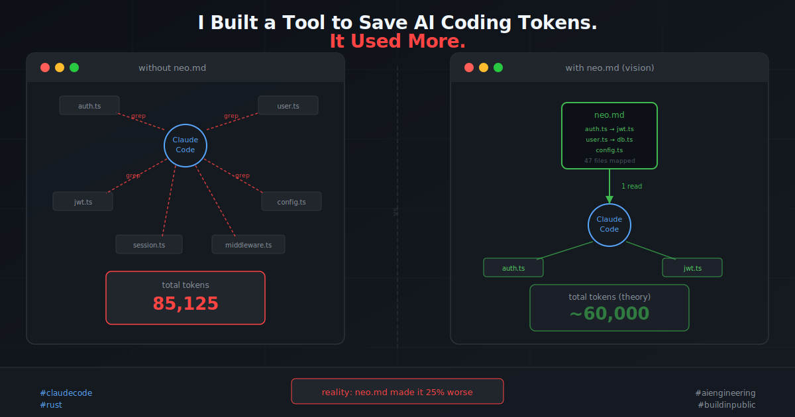

# I Built a Tool to Save AI Tokens. It Used More.



*A story about a good idea, a Rust CLI, and what the numbers taught me.*

---

Every time I start a new Claude Code session, the same thing happens.

Claude opens my project and immediately starts grepping. File after file. Search after search. It's like watching someone walk into a library and read the spine of every book before finding the one they want. Methodical. Thorough. Expensive.

I started wondering: what if there was a better way?

---

## The Problem is Real

Claude Code doesn't pre-index your codebase. That's by design — Anthropic says reactive search is "more flexible." But flexible has a cost.

Every grep result lands in the context window. Every file Claude reads stays there. A single session asking "how does auth work?" can easily burn 80,000+ tokens before Claude writes a single line of code.

```
Without a map — what actually happens today:

  You: "how does auth work?"
       ↓
  Claude: grep "auth" → 47 matches across 12 files
  Claude: read src/middleware/auth.ts
  Claude: read src/services/userService.ts
  Claude: read src/utils/jwt.ts
  Claude: grep "token" → 89 more matches
  Claude: read src/config/auth.config.ts
       ↓
  ~5 tool calls × ~500 tokens each = 2,500 tokens just to orient
  + the files themselves = another 15,000+ tokens cached
```

This felt like a solved problem. We have maps for everything — why not codebases?

---

## The Idea: Give Claude a Map

I started sketching in a conversation with Claude. The core idea was simple: a single file, `neo.md`, that lived in the project root. Before doing anything, Claude would read it. One read, four thousand tokens, and then navigate directly to the right files.

No more grepping. No more blind exploration.

```
With Neo — what I imagined:

  You: "how does auth work?"
       ↓
  Claude: read neo.md (~4,000 tokens, one shot)
       ↓
  neo.md says:
    src/middleware/auth.ts  | JWT validation and session handling
    src/services/userService.ts | User lookup and credential checks
    src/config/auth.config.ts | Auth configuration and secrets
       ↓
  Claude: read exactly those 3 files
  Done.
```

The math was attractive. The assumption was that replacing 10 grep calls (5,000–7,500 tokens) with one focused read (~4,000 tokens) would save tokens on every task, every session, compounding over time.

I named the idea Neo. Then I built it.

---

## What I Built

Neo is a Rust CLI that scans your codebase, builds a dependency graph, runs AI summarization on every file, detects conventions, and writes everything into a compact `neo.md`.

```
┌─────────────────────────────────────────────────────┐
│                     CLI Layer                        │
│         neo init │ neo update │ neo validate         │
└────────────────────────┬────────────────────────────┘
                         │
┌────────────────────────▼────────────────────────────┐
│                    Core Engine                       │
│         scanner → parser → graph → writer            │
└──────┬──────────────┬──────────────────┬────────────┘
       │              │                  │
┌──────▼──────┐ ┌─────▼──────┐ ┌────────▼───────┐
│  AI Layer   │ │Parser Layer│ │  Agent Layer   │
│  summarizer │ │  ts/py/... │ │  CLAUDE.md     │
│  conventions│ │  detector  │ └────────────────┘
└─────────────┘ └────────────┘
                         │
                    ┌────▼────┐
                    │ neo.md  │
                    └─────────┘
```

Three commands. One workflow.

**`neo init`** — scans everything, calls Claude Haiku to summarize each file in one line, detects hotspots (files imported by 3+ others), infers conventions, writes `neo.md`, and updates `CLAUDE.md` with instructions to use it.

**`neo update src/auth.ts`** — incremental update after a file changes. Re-parses, re-summarizes, rebuilds the graph.

**`neo validate`** — CI check. Errors on ghost files, warns on missing files.

The output format was deliberate. Pipe-delimited flat text, not JSON. Every `{}[]:"` character costs tokens. The whole file targets 4,000 tokens for a 200-file codebase.

```
# NEO
generated: 2026-03-11 | files: 47 | language: typescript | version: 1

## STRUCTURE
src/middleware/auth.ts | JWT validation and session handling | deps: src/utils/jwt.ts
src/services/userService.ts | User lookup, credential checks, password hashing
src/utils/jwt.ts | Token creation, signing, and verification

## HOTSPOTS
src/utils/jwt.ts | 8 dependents | edit carefully
src/config/env.ts | 12 dependents | edit carefully

## CONVENTIONS
error-handling: AppError class from utils/errors.ts (confidence: 91%)
api-calls: services/api/* only, never from components (confidence: 88%)

## ENTRY POINTS
app-entry: src/index.ts
navigation: src/navigation/RootNavigator.tsx
```

I was pretty happy with this. Clean, readable, information-dense. I wrote parsers for TypeScript and Python, built the dependency graph algorithm, wired up Claude Haiku for batch summarization (10 files per call to cut API costs by 78%).

Then I tested it.

---

## The Numbers

I picked a real codebase — a TypeScript app called Notto. I asked the same question in two fresh Claude Code sessions: *"how does auth work?"*

Session one: no `neo.md`. Let Claude navigate naturally.
Session two: `neo.md` present. CLAUDE.md tells Claude to read it first.

Here's what I got:

```
┌─────────────────┬────────────────┬───────────────┬────────────┐
│                 │ Without neo.md │  With neo.md  │ Difference │
├─────────────────┼────────────────┼───────────────┼────────────┤
│ Input           │             13 │             9 │         -4 │
│ Output          │            694 │           893 │       +199 │
│ Cache read      │         71,245 │        82,074 │    +10,829 │
│ Cache write     │         13,173 │        23,514 │    +10,341 │
│ Total           │         85,125 │       106,490 │    +21,365 │
└─────────────────┴────────────────┴───────────────┴────────────┘
```

The session *with* neo.md used **25% more tokens**.

I tightened the CLAUDE.md instructions — made them explicit, banned Grep and Glob by name, told Claude its *first action must be* reading neo.md.

```
┌─────────────────┬─────────────────────────┬────────────┐
│                 │ Strict instructions     │ Difference │
├─────────────────┼─────────────────────────┼────────────┤
│ Cache read      │                 145,341 │   +74,096  │
│ Total           │                 198,604 │  +113,479  │
└─────────────────┴─────────────────────────┴────────────┘
```

Stricter instructions made it worse. Much worse.

---

## What Actually Happened

I spent a while staring at these numbers.

Then it clicked: **neo.md added to the cache but didn't replace file searches.** Claude read neo.md — and then searched anyway. The file was an extra step, not a replacement. I built a map that the navigator glanced at before going exploring regardless.

The stricter instructions made it worse because they forced Claude to engage more deeply with neo.md — reading, processing, reasoning about it — before doing the same searches it would have done anyway. More thinking, same behavior, higher bill.

Neo's value turned out to be behavioral, not structural. Having the information available wasn't enough. What needed to change was *how the model navigated* — and that's not something you can fix with a file.

```
What I assumed:

  neo.md exists → Claude reads it → Claude skips searches

What actually happened:

  neo.md exists → Claude reads it → Claude still searches
                                    (because that's its default)
```

There's a deeper issue too. For small-to-medium codebases, Claude Code's caching is actually quite efficient. The expensive part isn't the grepping — it's the file content being cached across turns. Neo adds to that cache without reducing the underlying file reads.

Neo's premise — that a pre-built map saves tokens — likely only holds when:
1. The codebase is large enough that grep exploration compounds painfully
2. The agent is in a context where it genuinely can't cache the whole thing
3. The behavioral change actually sticks

On a small TypeScript project that fits comfortably in context, Neo is overhead.

---

## What I'm Taking Away

I don't think the idea is dead. I think I built the wrong thing first.

The real problem isn't knowledge — it's behavior. Giving Claude a map and telling it to use the map are two different problems. The second one is harder.

A few directions I'm curious about:

**Pre-populated context injection.** What if neo.md content was injected at the system prompt level — before Claude even starts, before it has the option to search? Claude Code hooks can do this. The file wouldn't be something Claude decides to read; it would just be there.

**Large codebase testing.** My test was on a small project. The hypothesis might still hold at scale — where grep exploration genuinely can't converge before burning meaningful context. I haven't tested that yet.

**Behavioral enforcement at the tool level.** What if the hook intercepted Grep/Glob calls and redirected them through neo.md? Force the behavior at the infrastructure level rather than the instruction level.

---

## Why I'm Sharing This

I'm an engineer actively exploring the AI tooling space — building things that sit at the intersection of developer experience and AI agents. Neo is one of several experiments.

I'm sharing this because most write-ups about AI tooling are success stories. The failure cases are more instructive. The gap between "this should work" and "this works" in AI systems is where all the interesting problems live.

If you've built something in this space, or have thoughts on why the behavioral problem is hard to crack, I'd genuinely like to hear it. The codebase is on my machine and I'm still iterating.

The idea that every AI coding session should start with a fresh, cheap orientation to your codebase — rather than burning thousands of tokens re-discovering what's already known — still feels right to me. I just haven't figured out the right shape of the solution yet.

*What would you try next?*

---

*The full Neo codebase including token measurement scripts is something I'm happy to share — reach out or leave a comment.*
